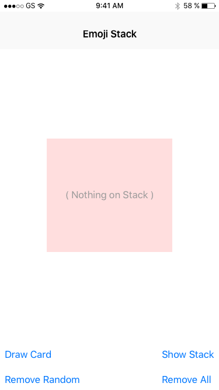
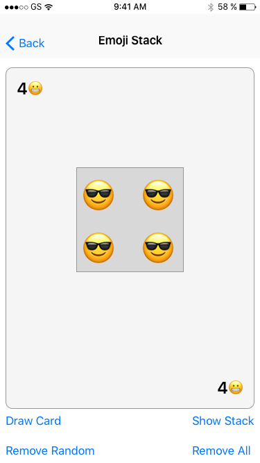
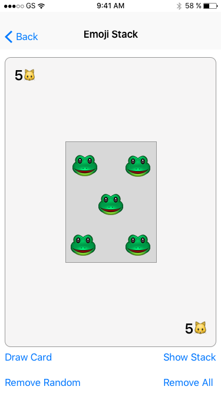
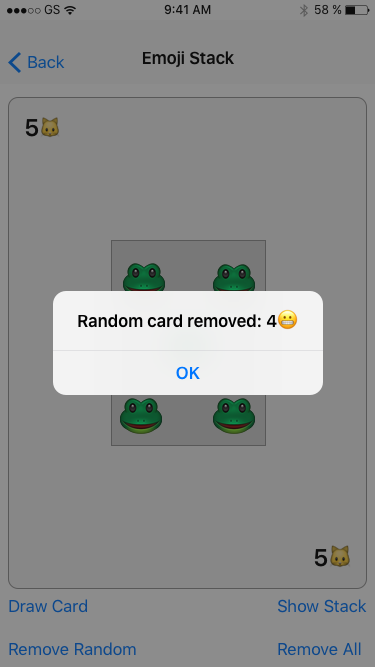
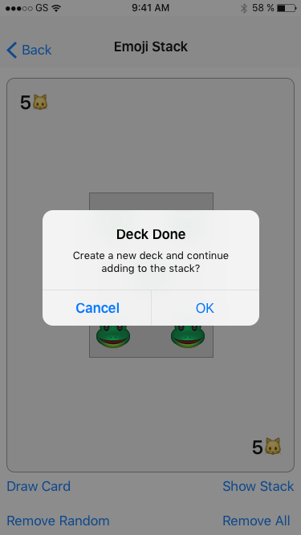
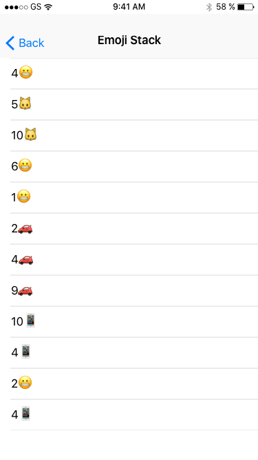

# AC3.2 In-Depth Views & View Controllers
---

### Readings
1. [The Role of View Controllers](https://developer.apple.com/library/content/featuredarticles/ViewControllerPGforiPhoneOS/index.html#//apple_ref/doc/uid/TP40007457)
2. [View Controller Hierarchy](https://developer.apple.com/library/content/featuredarticles/ViewControllerPGforiPhoneOS/TheViewControllerHierarchy.html#//apple_ref/doc/uid/TP40007457-CH33-SW1)

---
### All day programmatic! 


---
### View Controllers

1. Manages portions of your user interface
2. Facilitates transitions between different parts of the interface

All view controllers have a strong reference to their root view, which is set up in its `loadView()` function. It's rather uncommon to have to override `loadView`, but sometimes it is done to ensure that elements are added/set properly by the time `viewDidLoad` is called.

#### Root View Controller

> Every `UIWindow` has exactly one root view controller whose contents fill that window. The root view controller defines the initial content seen by the user... The root view controller is accessible from the rootViewController property of the UIWindow object. When you use storyboards to configure your view controllers, UIKit sets the value of that property automatically at launch time. **For windows you create programmatically, you must set the root view controller yourself.**

It is possible to programmatically define all elements of a storyboard in code starting from the `AppDelegate`: 

```swift
  // embedding a UINavigationController in a ViewController
  func application(_ application: UIApplication, didFinishLaunchingWithOptions launchOptions: [UIApplicationLaunchOptionsKey: Any]?) -> Bool {
    
    // instantiate the ViewController
    let rootVC: ViewController = ViewController()
    
    // Instantiate the navVC, add the rootVC
    let navigationVC: UINavigationController = UINavigationController(rootViewController: rootVC)
    
    // Define the bounds of your app's window
    self.window = UIWindow(frame: UIScreen.main.bounds)
    
    // Set your rootVC
    self.window?.rootViewController = navigationVC
    
    // Last line that is required to display content:
    self.window?.makeKeyAndVisible()
    
    return true
  }
```

With this portion of the code defined, we can even go into our project settings and remove our reference to our story board entirely! Congratulations, we are no longer burdened by the merge conflicts associated with storyboards... (pause for sigh of relief)...

#### Container View Controllers

Help to assemble and manage a hierarchy of child view controllers. Some examples include `UINavigationController, UISplitViewController, UITabBarController, UIPageViewController`. A container view controller's view always takes up 


---
### Exercise: Emoji Card Stack

**Guidelines:**

1. An `EmojiDeck` has total of 40 `EmojiCard` with 10 of each of the four suits, numbered from 1 through 10:
  - Smileys 😬
  - Animals 🐱
  - Transport 🚗
  - Electronics 📱
2. An `EmojiCardViewController` displays exactly 1 `EmojiCard`
3. `EmojiCard` is a `UIView` subclass 
4. `EmojiCard` conforms to `PlayingCard` protocol
5. `EmojiCard` center image has the proper # of emojis from that suit
6. Removing a random `EmojiCard` should remove a random `EmojiCardViewController` from the nav stack
  - It should never remove the top-most card (the top of the nav stack)
7. The `EmojiDeckTableViewController` should display all of the cards currently on the stack. 







